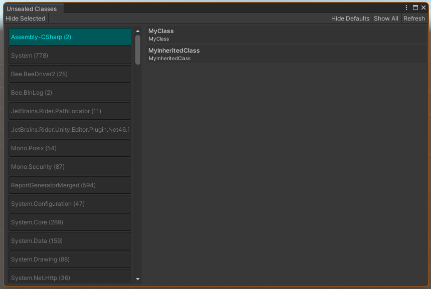
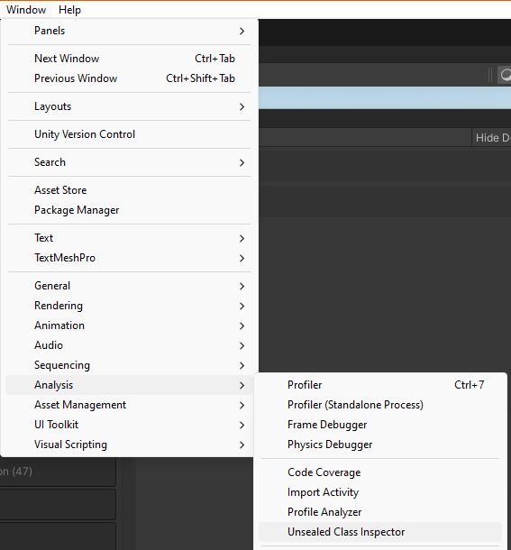

# Unsealed Class Finder
The Unsealed class finder is a simple (yet effective) editor tool to find and show unsealed classes in your codebase.
Sealing classes will tell the JIT compiler that it does not need to keep looking for inherited classes when calling virtual methods. 
Since C# is unsealed by default, it provides an easy way to extend your code but by doing that, there are some serious drawbacks 
and a non-zero cost to performance. Across an entire game, this cost adds up. Especially if there are lots of inherited 
classes.

<br/>

 <br/>
*The design is very human*

## Installation
To install this package:

1. Open the Unity Package Manager window
2. Click the "+" button in the top-left corner and select "Add Package by Git URL"
3. Paste ```https://github.com/DeepFreezeGames/com.deepfreeze.unsealedclassfinder.git``` into the popup box and click "install"
4. Profit

## Opening The Window
To open the window, navigate to "Window/Analysis/Unsealed Class Inspector"

<br/>

 <br/>
*Window location in the menu bar*

## WTF Does This Thing Do
The unsealed class inspector will scan all assemblies in the project and show all classes that are not explicitly sealed.
You can click on each assembly in the inspector sidebar to see classes inside it that are unsealed and not abstract.
Assemblies will be sorted by shown vs hidden status. You can manually hide an assembly by clicking the assembly and then
clicking the "Hide Selected" button in the top-left of the toolbar. You can hide all assemblies that <i>I</i> decided you 
probably don't care about by clicking the "Hide Defaults" button in the top-right of the toolbar. If you want to show all
assemblies, you can click "Show All" which will purge the "hidden assembly" preference. Hidden assemblies are stored in
EditorPrefs, so they will be unique to each user.